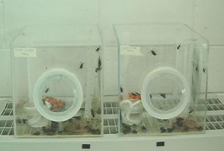

# ADULT CAGES {#adult-cages}

## Materials

-   Datasheets (\@ref(appendix))

-   Insect cage


## Methods

### Insect Cages {#insect-cages}

Label each cage is with the following: I = date initially set, T= date
when new adults are added, and \# = current number of adults in the
cage.

-   Add new 'T' labels each time new adult weevils are added to a cage,
    and update the '\#' as insect populations change.

-   Write clearly and legibly, or print labels with a label maker to
    avoid misunderstandings.

-   Record all information in the appropriate datasheets found in
    \@ref(appendix).

```{r adult-cage, cache = TRUE, cache.extra = file.mtime('figure/adult_cage.jpg'), fig.cap="Cages for adult \\textit{Diaprepes abbreviatus}: One new cage is started each month with around 50 adult \\textit{D. abbreviatus} per cubic foot", fig.scap="Cages for adult \\textit{Diaprepes abbreviatus}", warning=FALSE}

```

### Selecting Healthy Adult Weevils {#selecting-weevils}

- beans
